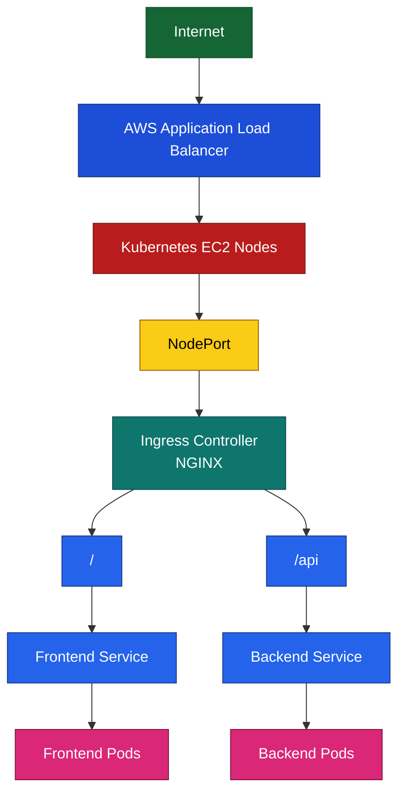

# This is a test project build to perform kubernetes practice.

### Global API Calls:
* GET `api/v1/info`
  * For getting the pod ip address and pod name.

### Level 1
Basic API calls:
* GET `api/v1/users`
* GET `api/v1/users/{id}`
* POST `api/v1/users`
* PUT `api/v1/users/{id}`
* DELETE `api/v1/users/{id}`

### Level 2
Creating a frontend for level 1 service. And then exposing both using a nginx ingress.

